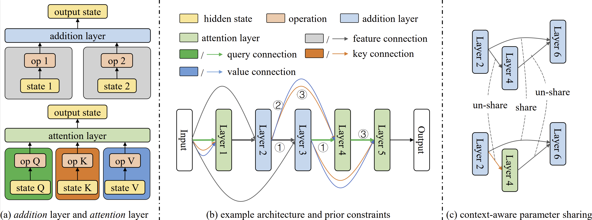

# AutoAttend: Automated Attention Representation Search

_code implementation of paper [AutoAttend: Automated Attention Representation Search](http://proceedings.mlr.press/v139/guan21a.html)._

Authors: [Chaoyu Guan](https://github.com/Frozenmad), Xin Wang, Wenwu Zhu

## Brief Introduction

<center>


</center>

We design an automated framework searching for the best self-attention models for given tasks. In which, we leverage functional layers to describe models with self-attention mechanisms, and propose context-aware parameter sharing to build and train the supernet, so that it can consider the specialty and functionality of parameters for different functional layers and inputs. More detailed algorithms can be found in our [paper](http://proceedings.mlr.press/v139/guan21a.html).

## Usage

### 1. Prepare the datasets

First, please prepare the [SST dataset](https://nlp.stanford.edu/sentiment/trainDevTestTrees_PTB.zip) and [pretrained glove embeddings](https://nlp.stanford.edu/data/glove.840B.300d.zip) under `./data` folder. The organization should be in following format:

```
+ data
  - glove.840B.300d.txt
  + sst
    + trees
      - train.txt
      - dev.txt
      - test.text
```

### 2. Preprocess the datasets

Run following command to prepare off-the-shelf datasets for speed up
```
python -m task.dataset.sst5
```

### 3. Train the supernet

Train the whole supernet running the following command:
```
python -m task.text_classification.train_supernet --epoch x
```
You can set the epoch number as you wish. In our paper, it is set to 10.

### 4. Search for the best architectures

Get the best architectures using evolution algorithms running:
```
python -m task.text_classification.search_supernet --model_path ./searched/model_epoch_x.full --devices 0 1 2 3 0 1 2 3
```
Where x is the epoch number. In our case it is 10. You can set the device number you want to use, and you can pass repeated device number. The code will run in multiprocessing way according to the device number you passed.

### 5. Retrain the architectures

Re-evaluate the searched models using following cmd:
```
python -m task.text_classification.retrain --arch "xxxx"
```

The `xxxx` should be replaced with the architectures searched. The best architecture we find is
```
python -m task.text_classification.retrain --arch "[[4, 0, 1, -1, 0], [0, 0, 3, -1, 0], [1, 0, 3, 1, 1], [1, 1, 3, 1, 1], [0, 1, 4, -1, 0], [2, 5, 1, 3, 1], [3, 1, 2, 1, 1], [3, 1, 3, 2, 1], [1, 1, 1, -1, 0], [1, 1, 2, 1, 1], [1, 2, 3, 4, 1], [3, 6, 4, 0, 1], [3, 2, 0, -1, 0], [1, 0, 0, -1, 0], [1, 4, 4, 0, 1], [3, 15, 2, 1, 1], [3, 10, 1, -1, 0], [1, 14, 2, 3, 1], [3, 18, 1, 2, 1], [4, 9, 0, -1, 0], [1, 16, 1, -1, 0], [0, 12, 0, -1, 0], [4, 3, 3, 2, 1], [2, 0, 4, -1, 0]]"
```

You should derive a mean test accuracy around `0.5371`

## Codes for Graph

The codes for searching graph models will be published at our [AutoGL library](https://github.com/THUMNLab/AutoGL) soon!

## Cite Us

If you find our work helpful, please cite our paper as following:

```
@InProceedings{guan21autoattend,
  title = 	 {AutoAttend: Automated Attention Representation Search},
  author =       {Guan, Chaoyu and Wang, Xin and Zhu, Wenwu},
  booktitle = 	 {Proceedings of the 38th International Conference on Machine Learning},
  pages = 	 {3864--3874},
  year = 	 {2021},
  editor = 	 {Meila, Marina and Zhang, Tong},
  volume = 	 {139},
  series = 	 {Proceedings of Machine Learning Research},
  month = 	 {18--24 Jul},
  publisher =    {PMLR},
  pdf = 	 {http://proceedings.mlr.press/v139/guan21a/guan21a.pdf},
  url = 	 {http://proceedings.mlr.press/v139/guan21a.html}
```
